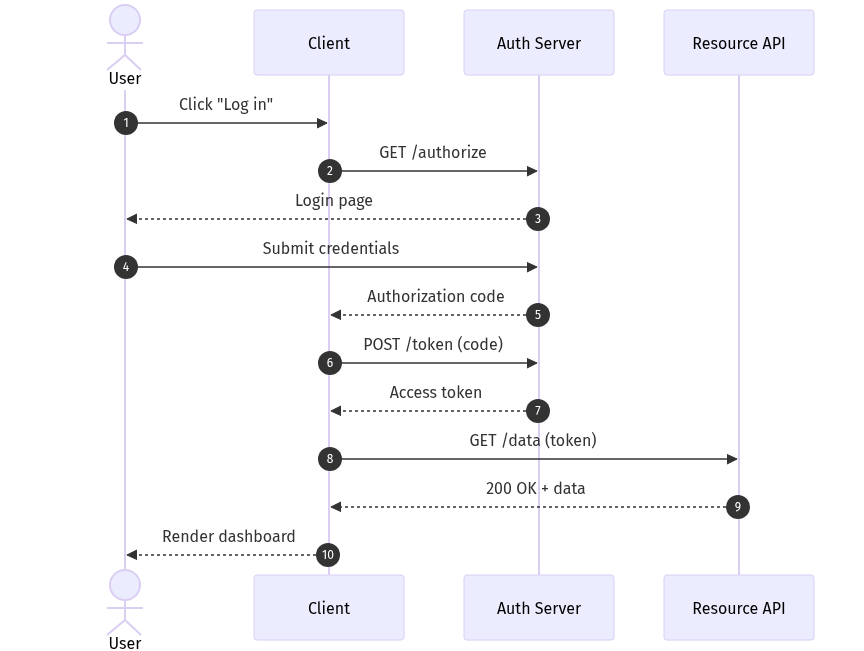
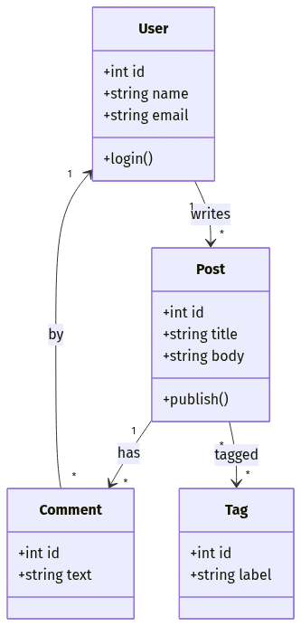
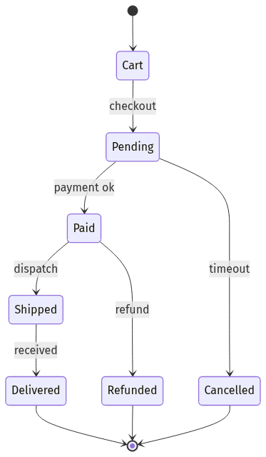
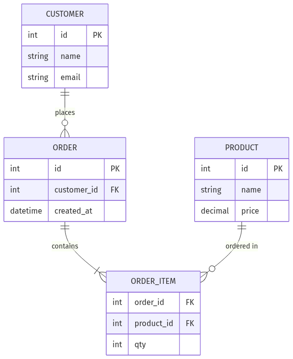
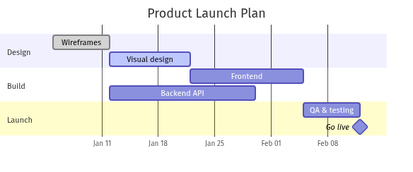
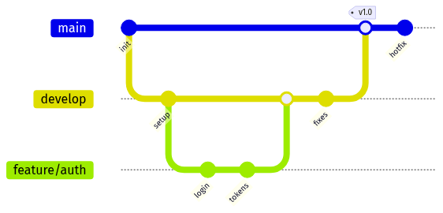

# mermaid-skill —— 从代码到图片,一步到位

[](LICENSE)
[](https://github.com/Agents365-ai/mermaid-skill/stargazers)
[](https://github.com/Agents365-ai/mermaid-skill/network/members)
[](https://github.com/Agents365-ai/mermaid-skill/releases/latest)
[](https://github.com/Agents365-ai/mermaid-skill/commits/main)

[](https://skillsmp.com/skills/agents365-ai-mermaid-skill-skills-mermaid-skill-skill-md)
[](https://clawhub.ai/agents365-ai/mermaid-pro-skill)
[](https://github.com/Agents365-ai/365-skills)
[](https://agentskills.io)
[English](README.md) · **中文** · [📖 在线文档](https://agents365-ai.github.io/mermaid-skill/zh.html)

一个把自然语言转成 `.mmd` 源码、导出前自动校验语法,再通过 `mmdc` CLI 或 Kroki HTTP API 渲染为 PNG / SVG / PDF 的技能。支持 **Claude Code、Cursor、Copilot、OpenClaw、Codex、Hermes** 等任何兼容 [Agent Skills](https://agentskills.io) 规范的 agent。

<p align="center">
  
</p>

## ✨ 核心亮点

- **11+ 种图表类型** —— 流程图、时序图、类图、ER、状态图、甘特、饼图、Git 图、C4 上下文、思维导图等,全部自动布局(无需 x/y 坐标)
- **校验优先的工作流** —— 每个 `.mmd` 都先解析再导出,坏图永远不会变成 PNG
- **视觉自检 + 评审循环** —— 读取导出的 PNG,捕捉自动布局也防不住的可读性/排版缺陷(标签被截断、过于拥挤、方向不当),自动修复(≤2 轮),再根据你的反馈迭代(≤5 轮)
- **两套后端,一个技能** —— 本地 `mmdc` 质量最佳,Kroki HTTP API 作为零安装备选(只要 `curl`)
- **文本源码 = 友好版本管理** —— `.mmd` 是纯文本,在 PR 里 diff 清晰,可直接嵌入 GitHub / GitLab README
- **主动触发** —— 讨论架构、API 流程、状态机时自动激活(中英文关键词都支持)
- **多智能体、零配置** —— 单个 SKILL.md,无 MCP,无后台 daemon(可选的 `npx` 安装器需要 Node,技能本身不需要)

## 🖼️ 示例

> [!TIP]
> **页首那张图就是用下面这条提示词生成的:**

```
画一个微服务电商架构图,包含 Mobile/Web 客户端、API 网关、
User/Order/Product/Payment 服务,以及 User DB / Order DB /
Product DB / Redis Cache
```

### 更多图表类型

Mermaid 自动布局 11+ 种类型 —— 下面每张都由一句提示词生成,并走了 校验 → 导出 → 自检 流程:

<table>
  <tr>
    <td align="center"><br><sub><b>时序图</b> · 认证流程</sub></td>
    <td align="center"><br><sub><b>类图</b> · 领域模型</sub></td>
    <td align="center"><br><sub><b>状态图</b> · 订单生命周期</sub></td>
  </tr>
  <tr>
    <td align="center"><br><sub><b>ER 图</b> · 电商 schema</sub></td>
    <td align="center"><br><sub><b>甘特图</b> · 发布计划</sub></td>
    <td align="center"><br><sub><b>Git 图</b> · 分支策略</sub></td>
  </tr>
</table>

完整能力矩阵见 [docs/features_CN.md](docs/features_CN.md)。页首、工作流与画廊插图的源 `.mmd` 与导出 PNG 都放在 [`assets/`](assets/) 目录(`example-{sequence,class,state,er,gantt,gitgraph}.mmd`)。

## 🚀 安装

### 1. 选择导出后端

| 选项 | 命令 | 适用场景 |
| --- | --- | --- |
| **A —— 本地 `mmdc`** | `npm install -g @mermaid-js/mermaid-cli && mmdc --version` | 质量最佳、可控主题、离线使用 |
| **B —— Kroki API** | `curl --version` | 无需安装、无需 Node、CI/CD 流水线 |

技能会先尝试 `mmdc`,失败时自动回退到 Kroki。

### 2. 安装技能

```bash
# 任意 Agent(Claude Code、Cursor、Copilot 等)
npx skills add Agents365-ai/365-skills -g
```

```text
# Claude Code 插件市场
> /plugin marketplace add Agents365-ai/365-skills
> /plugin install mermaid
```

```bash
# 手动安装
git clone https://github.com/Agents365-ai/mermaid-skill.git \
  ~/.claude/skills/mermaid-skill
```

同时索引于 [SkillsMP](https://skillsmp.com/skills/agents365-ai-mermaid-skill-skills-mermaid-skill-skill-md) 与 [ClawHub](https://clawhub.ai/agents365-ai/mermaid-pro-skill)。

**更新:** `/plugin update mermaid`(Claude Code)、`skills update mermaid-skill`(SkillsMP)、`clawhub update mermaid-pro-skill`(OpenClaw),或 `git pull`(手动安装)。

## ⚡ 快速开始

装好之后直接描述你想要的图表,比如一个 JWT 认证时序图:

```
画一个 JWT 登录的时序图:Client 把账号密码发给 API Gateway,
Gateway 调 Auth Service,Auth Service 查 User DB、校验密码哈希,
然后把签名后的 JWT 沿路径返回给 Client。同时画出密码错误的失败分支。
```

技能会自动选图表类型、写 `.mmd` 源码、用 `mmdc`(或 Kroki)校验、导出你想要的格式,并报告输出路径。

## 🧩 支持的图表类型

| 类型 | 关键词 | 适用场景 |
| --- | --- | --- |
| 流程图 | `flowchart TD/LR` | 业务流程、流水线、决策树 |
| 时序图 | `sequenceDiagram` | API 调用、认证流程、消息传递 |
| 类图 | `classDiagram` | OOP 模型、领域实体、继承关系 |
| ER 图 | `erDiagram` | 数据库模式、表关系 |
| 状态图 | `stateDiagram-v2` | 状态机、生命周期 |
| 甘特图 | `gantt` | 项目时间线、迭代规划 |
| 饼图 | `pie` | 占比、分布 |
| Git 图 | `gitGraph` | 分支策略、GitFlow |
| C4 上下文 | `C4Context` | 高层架构 |
| 思维导图 | `mindmap` | 主题拆解、头脑风暴 |
| 用户旅程 | `journey` | 用户路径 |

各类型语法参考见 [`skills/mermaid-skill/reference/`](skills/mermaid-skill/reference/),完整能力矩阵见 [docs/features_CN.md](docs/features_CN.md)。

## 🔄 工作流程

<p align="center">
  
</p>

幕后流程:**检查依赖(`mmdc` 或 Kroki)→ 选图表类型 → 写 `.mmd` → 校验语法(出错则修复并重新校验)→ 导出 PNG/SVG/PDF → 视觉自检渲染图并自动修复可读性/排版缺陷(≤2 轮)→ 根据你的反馈评审循环(≤5 轮)→ 报告输出路径**。详见 [docs/workflow_CN.md](docs/workflow_CN.md)。

## 🆚 对比

### 对比原生智能体(无 skill)

| 功能 | 原生智能体 | mermaid-skill |
| --- | --- | --- |
| 写 Mermaid 语法 | ✅ 内置 | ✅ 配示例 + 参考文档引导 |
| 导出前校验 | ❌ 默默导出坏图 | ✅ 必经步骤,出错自动重试 |
| 导出后自检 | ❌ 从不看渲染结果 | ✅ 视觉读取 PNG,自动修复排版/可读性(≤2 轮) |
| 迭代评审循环 | ❌ 手动重新提示 | ✅ 定向 `.mmd` 编辑,5 轮安全阀 |
| 导出为 PNG / SVG / PDF | ❌ 手动跑 `mmdc` | ✅ 自动选用一种后端 |
| 零安装备选 | ❌ | ✅ Kroki API 只要 `curl` |
| 主动触发 | ❌ 必须显式要求 | ✅ 3+ 组件、API 流程、状态机自动触发 |
| 中英双语触发 | ❌ 仅英文 | ✅ 中英关键词都支持 |
| 图表类型引导 | 一般化 | ✅ 11+ 类型表 + 可复制模板 |

## 🎯 何时用(以及何时别用)

**适合:**

- 以代码画图 —— 文本定义、自动布局、对版本控制友好,可直接嵌入 Markdown / README / 文档
- 从文字描述快速生成流程图、时序图、类图、状态图、ER 图、甘特图、思维导图
- 希望图的源码就放在代码旁边、自动重新渲染的场景

**这些情况请改用同系列的其它 skill:**

- **像素级定位、自定义布局、品牌图标、复杂样式** → [drawio-skill](https://github.com/Agents365-ai/drawio-skill)
- **手绘 / 潦草观感** → [excalidraw-skill](https://github.com/Agents365-ai/excalidraw-skill) 或 [tldraw-skill](https://github.com/Agents365-ai/tldraw-skill)
- **无限画布 / 自由手绘** → [tldraw-skill](https://github.com/Agents365-ai/tldraw-skill)
- **严格、规范的 UML 记法** → [plantuml-skill](https://github.com/Agents365-ai/plantuml-skill)

## 🔗 相关 Skill

[Agents365-ai 图表 skill 家族](https://github.com/Agents365-ai) 一员 —— 按场景挑工具:

| Skill | 风格 | 适用场景 |
| --- | --- | --- |
| [drawio-skill](https://github.com/Agents365-ai/drawio-skill) | XML、可手动控制布局 | 精修架构图、ML 模型图 |
| [excalidraw-skill](https://github.com/Agents365-ai/excalidraw-skill) | 手绘 / 草图 | 白板原型、非正式图 |
| [plantuml-skill](https://github.com/Agents365-ai/plantuml-skill) | UML 专精 | CI 流水线里的类图 / 序列图 |
| [tldraw-skill](https://github.com/Agents365-ai/tldraw-skill) | 白板协作 | 随手画、FigJam 风格 |

## ❤️ 支持作者

如果这个 skill 对你有帮助,欢迎支持作者:

<table>
  <tr>
    <td align="center">
      
      <br>
      <b>微信支付</b>
    </td>
    <td align="center">
      
      <br>
      <b>支付宝</b>
    </td>
    <td align="center">
      
      <br>
      <b>Buy Me a Coffee</b>
    </td>
    <td align="center">
      
      <br>
      <b>打赏</b>
    </td>
  </tr>
</table>

## 👤 作者

**Agents365-ai**

- GitHub: <https://github.com/Agents365-ai>
- Bilibili: <https://space.bilibili.com/441831884>

## 📄 许可证

[MIT](LICENSE)
