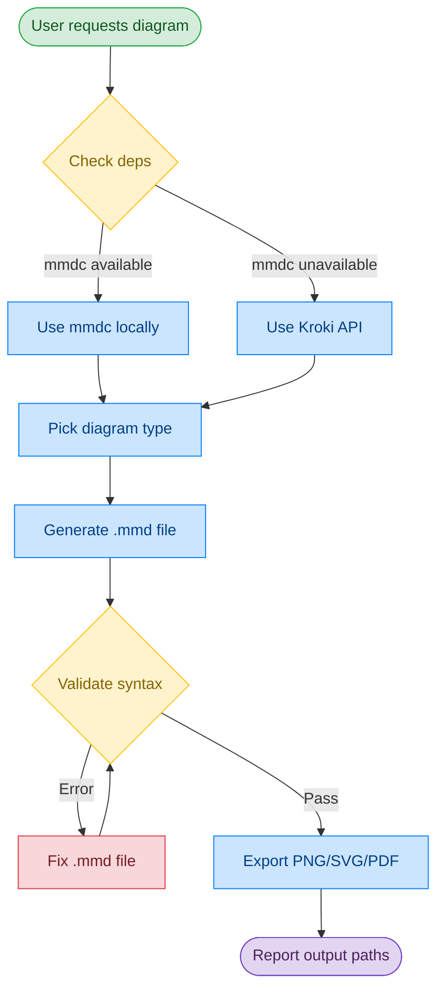
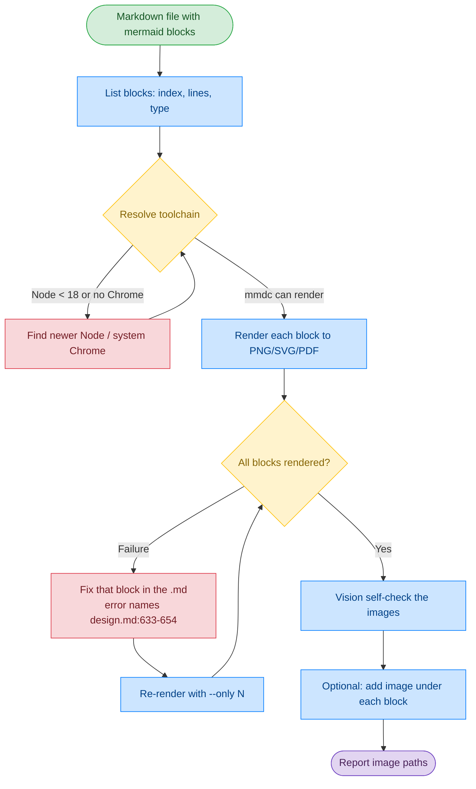

# Workflow & File Structure

[← Back to README](../README.md)

## How It Works

This skill follows a validation-first workflow:


<details>
<summary>View Mermaid source</summary>



**Color legend:** 🟢 Input | 🔵 Process | 🟡 Decision | 🔴 Warning | 🟣 Output

</details>

## mermaid-md — the Markdown-first workflow

`mermaid-md` starts from a Markdown file that already contains ` ```mermaid ` blocks. The
Markdown stays the source of truth: failures point back at the block's line range, you fix
it there, and re-render just that block.


<details>
<summary>View Mermaid source</summary>



**Color legend:** 🟢 Input | 🔵 Process | 🟡 Decision | 🔴 Warning | 🟣 Output

</details>

```bash
SKILL=skills/mermaid-md

python3 $SKILL/scripts/mermaid_md.py docs/design.md --list           # 1. inventory
python3 $SKILL/scripts/mermaid_md.py docs/design.md -o docs/assets/  # 2. render
python3 $SKILL/scripts/mermaid_md.py docs/design.md -o docs/assets/ --only 3   # 3. after a fix
python3 $SKILL/scripts/mermaid_md.py docs/design.md -o docs/assets/ --in-place # 4. embed
```

Step 4 keeps the mermaid block and puts the image underneath it, and re-running refreshes
that image line instead of adding another — so it is safe in a pre-commit hook. Details in
[`skills/mermaid-md/SKILL.md`](../skills/mermaid-md/SKILL.md).

## File Structure

```
mermaid-skill/
├── skills/
│   ├── mermaid-skill/              # author diagrams from a prompt
│   │   ├── SKILL.md
│   │   └── reference/
│   │       ├── FLOWCHART.md        # flowchart syntax & examples
│   │       ├── SEQUENCE.md         # sequence diagram syntax
│   │       ├── CLASS-ER.md         # class & ER diagram syntax
│   │       ├── ARCHITECTURE.md     # architecture-beta syntax
│   │       ├── USECASE.md          # use case syntax
│   │       └── OTHER-TYPES.md      # state, Gantt, git, pie, mindmap, C4
│   ├── mermaid-md/                 # render mermaid blocks inside a .md
│   │   ├── SKILL.md
│   │   ├── scripts/
│   │   │   └── mermaid_md.py       # extract → render → optional rewrite
│   │   └── reference/
│   │       └── EMBEDDING.md        # which targets need images, paths, CI
│   └── md-to-docx/                 # Markdown → Word (.docx)
│       ├── SKILL.md                # vendored from github/awesome-copilot (MIT)
│       ├── NOTICE.md               # upstream commit + how to refresh it
│       ├── LICENSE
│       └── scripts/
│           ├── md-to-docx.mjs
│           └── package.json
├── assets/                         # example .mmd sources + rendered PNGs
├── docs/                           # this documentation site
├── README.md                       # English docs (default)
└── README_CN.md                    # Chinese docs
```
