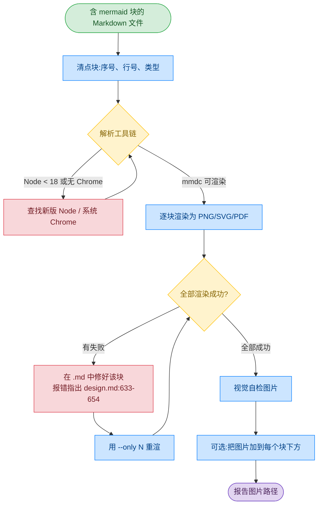

# 工作流程与文件结构

[← 返回 README](../README_CN.md)

## 工作流程

本技能采用验证优先的工作流:


<details>
<summary>查看 Mermaid 源码</summary>


**颜色图例:** 🟢 输入 | 🔵 处理 | 🟡 决策 | 🔴 警告 | 🟣 输出

</details>

## mermaid-md —— 以 Markdown 为起点的工作流

`mermaid-md` 的起点是一份已经含有 ` ```mermaid ` 块的 Markdown。Markdown 始终是唯一真相:
报错会指回该块的行号区间,你就地修好,再只重渲这一块。


<details>
<summary>查看 Mermaid 源码</summary>



**颜色图例:** 🟢 输入 | 🔵 处理 | 🟡 判断 | 🔴 警告 | 🟣 输出

</details>

```bash
SKILL=skills/mermaid-md

python3 $SKILL/scripts/mermaid_md.py docs/design.md --list           # 1. 清点
python3 $SKILL/scripts/mermaid_md.py docs/design.md -o docs/assets/  # 2. 渲染
python3 $SKILL/scripts/mermaid_md.py docs/design.md -o docs/assets/ --only 3   # 3. 改完重渲
python3 $SKILL/scripts/mermaid_md.py docs/design.md -o docs/assets/ --in-place # 4. 嵌入
```

第 4 步会保留 mermaid 代码块,把图片放在它下面;重复运行只刷新那行图片而不会新增,
因此可以放进 pre-commit 钩子。细节见 [`skills/mermaid-md/SKILL.md`](../skills/mermaid-md/SKILL.md)。

## 文件结构

```
mermaid-skill/
├── skills/
│   ├── mermaid-skill/              # 从提示词画新图
│   │   ├── SKILL.md
│   │   └── reference/
│   │       ├── FLOWCHART.md        # 流程图语法与示例
│   │       ├── SEQUENCE.md         # 时序图语法
│   │       ├── CLASS-ER.md         # 类图与 ER 图语法
│   │       ├── ARCHITECTURE.md     # architecture-beta 语法
│   │       ├── USECASE.md          # 用例图语法
│   │       └── OTHER-TYPES.md      # 状态图、甘特图、Git 图、饼图、思维导图、C4
│   ├── mermaid-md/                 # 渲染 .md 里的 mermaid 块
│   │   ├── SKILL.md
│   │   ├── scripts/
│   │   │   └── mermaid_md.py       # 提取 → 渲染 → 可选改写
│   │   └── reference/
│   │       └── EMBEDDING.md        # 哪些平台需要图片、路径、CI
│   └── md-to-docx/                 # Markdown → Word (.docx)
│       ├── SKILL.md                # 取自 github/awesome-copilot(MIT)
│       ├── NOTICE.md               # 上游 commit 与同步方式
│       ├── LICENSE
│       └── scripts/
│           ├── md-to-docx.mjs
│           └── package.json
├── assets/                         # 示例 .mmd 源码 + 渲染出的 PNG
├── docs/                           # 本文档站点
├── README.md                       # 英文文档(默认)
└── README_CN.md                    # 中文文档
```
