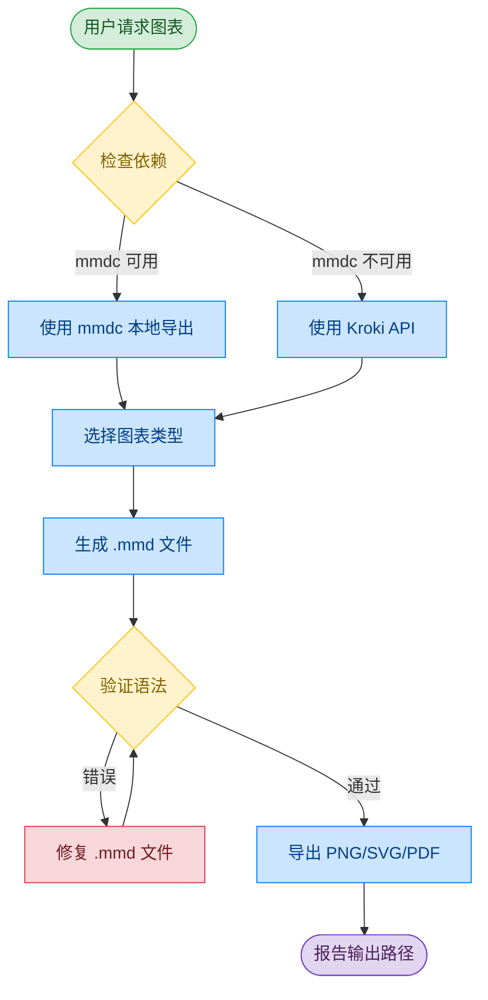

# 工作流程与文件结构

[← 返回 README](../README_CN.md)

## 工作流程

本技能采用验证优先的工作流:


<details>
<summary>查看 Mermaid 源码</summary>



**颜色图例:** 🟢 输入 | 🔵 处理 | 🟡 决策 | 🔴 警告 | 🟣 输出

</details>

## 文件结构

```
mermaid-skill/
├── SKILL.md              # 主技能说明
├── reference/
│   ├── FLOWCHART.md      # 流程图语法和示例
│   ├── SEQUENCE.md       # 时序图语法
│   ├── CLASS-ER.md       # 类图和 ER 图语法
│   └── OTHER-TYPES.md    # 状态图、甘特图、Git图、饼图、思维导图、C4
├── assets/
│   ├── example.mmd       # 示例:微服务架构
│   ├── example.png
│   ├── workflow.mmd      # 示例:工作流(英文)
│   ├── workflow.png
│   ├── workflow_cn.mmd   # 示例:工作流(中文)
│   └── workflow_cn.png
├── README.md             # 英文文档(默认)
└── README_CN.md          # 中文文档
```
