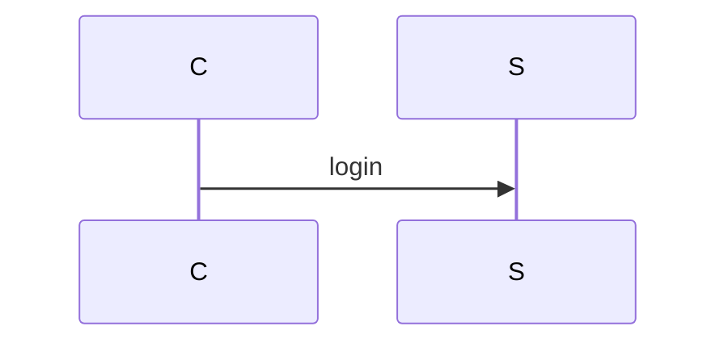

# Embedding rendered images back into Markdown

## Decide first: do you actually need images?

| Target | Renders ` ```mermaid ` natively? | Do |
| --- | --- | --- |
| GitHub (README, issues, PRs, wiki) | Yes | Keep the code block; no images |
| GitLab | Yes | Keep the code block |
| Obsidian, Notion, Typora, VS Code preview | Yes | Keep the code block |
| Docusaurus / MkDocs Material / Hugo | Yes, with the mermaid plugin enabled | Keep the block, enable the plugin |
| Pandoc → DOCX / PDF / LaTeX | No | Render images, `--rewrite-mode replace` |
| Confluence, SharePoint, Google Docs | No | Render images, paste or attach them |
| Slides (Marp, reveal.js, PowerPoint) | Partially | Render images |
| Chat / email / a PR comment with a picture | No | Render one image, attach it |

Rendering images duplicates state: the PNG goes stale when the block changes. Prefer native
rendering wherever it exists, and if you do commit images, re-run the script in CI (`--check`
at minimum) so drift gets caught.

## Rewrite modes

`--rewrite-mode append` (**default**) — the mermaid block stays exactly where it was and the
image is added underneath. The diagram source remains the thing you edit and review, the
image is just a rendering of it. Use this unless there is a reason not to.

````markdown



````

Re-running is **idempotent**: an image already sitting under a block is rewritten in place,
so `--in-place` can be re-run after every diagram edit without stacking duplicates.

`--rewrite-mode replace` — the block is swapped out for the image, losing the source from
that file. Only for a one-way export to a target that must not contain code fences.

```markdown

```

## Paths

The script writes image paths **relative to the rewritten Markdown file**, so keep the image
directory inside the docs tree (`docs/assets/…` next to `docs/design.md`). Rendering into a
directory outside the doc tree produces `../../…` paths that break once the file is moved or
published.

Common layout:

```
docs/
  design.md            # source of truth, mermaid blocks live here
  design.rendered.md   # generated, do not hand-edit
  assets/
    design-01-auth-flow.png
```

Add the generated Markdown and images to `.gitignore` if they are build output rather than
committed artifacts.

## HTML/alt text

The alt text comes from the block title (`%% title:`, front-matter `title:`, or the nearest
heading), so give every block a title when the images will be published — screen readers and
broken-image states rely on it.

For width control in Markdown that permits HTML:

```html

```

The rewrite always emits plain Markdown image syntax; switch to `` by hand afterwards
if a specific width matters.

## Keeping images in sync (CI)

```bash
# Fails the build if any mermaid block in the docs no longer renders
python3 skills/mermaid-md/scripts/mermaid_md.py docs/design.md --check
```

CI images rarely ship a browser: install one in the job (`npx puppeteer browsers install
chrome-headless-shell`) or point `--chrome` at the runner's Chrome. The script adds
`--no-sandbox` on its own when running as root in a container.

For a repo-wide sweep:

```bash
find docs -name '*.md' -print0 | xargs -0 -n1 \
  python3 skills/mermaid-md/scripts/mermaid_md.py --check
```
